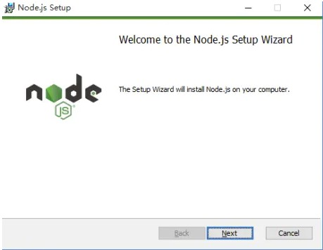

# VUE 教学


### vue如何新建一个项目

vue 创建项目（npm安装→初始化项目）
cli2 和 >cli2脚手架创建

#### 第一步npm安装

首先：先从nodejs.org中下载nodejs





直到Finish完成安装。

打开控制命令行程序（CMD）,检查是否正常


**使用淘宝NPM 镜像**

大家都知道国内直接使用npm 的官方镜像是非常慢的，这里推荐使用淘宝 NPM 镜像。

`$ npm install -g cnpm --registry=https://registry.npm.taobao.org`

这样就可以使用cnpm 命令来安装模块了：

#### 第二步项目初始化

1.第一步：安装vue-cli(==管理员权限打开CMD==)

cnpm install vue-cli -g   //全局安装 vue-cli


查看vue-cli是否成功，不能检查vue-cli,需要检查vue list


选定路径，新建vue项目，这里我是在桌面上新建了sun文件夹，cd目录路径

下面我一项目名为sell新建vue项目

**cli2 创建项目** 

vue init webpack ”项目名称“ (项目名称不可以用驼峰命名法)


现在已经创建好了，那就让项目先安装下依赖再运行一下，会出现下面的页面，操作指令是：

**cnpm install**

**cnpm run dev**

注意 这里要在sell下进行安装和运行哦!!!


安装成功啦


### Element UI使用

> Element UI是VUE框架所支持的UI库，他能在我们开发过程中快速生成我们的UI样式
> 并且它的组件能够做到开箱即用bug少，样式美观

#### 安装

* npm安装

必须进到当前项目的目录下执行下面的命令进行安装

~~~javascript
npm i element-ui -S
~~~

在mian.js下面引入Element UI，然后再helloVue测试

* CDN在线引用

~~~javascript
<!-- 引入样式 -->
<link rel="stylesheet" href="https://unpkg.com/element-ui/lib/theme-chalk/index.css">
<!-- 引入组件库 -->
<script src="https://unpkg.com/element-ui/lib/index.js"></script>
~~~

**Hello world**案例

```html
<!DOCTYPE html>
<html>
<head>
  <meta charset="UTF-8">
  <!-- import CSS -->
  <link rel="stylesheet" href="https://unpkg.com/element-ui/lib/theme-chalk/index.css">
</head>
<body>
  <div id="app">
    <el-button @click="visible = true">Button</el-button>
    <el-dialog :visible.sync="visible" title="Hello world">
      <p>Try Element</p>
    </el-dialog>
  </div>
</body>
  <!-- import Vue before Element -->
  <script src="https://unpkg.com/vue/dist/vue.js"></script>
  <!-- import JavaScript -->
  <script src="https://unpkg.com/element-ui/lib/index.js"></script>
  <script>
    new Vue({
      el: '#app',
      data: function() {
        return { visible: false }
      }
    })
  </script>
</html>
```

### 路由的使用

~~~vue
cnpm install vue-router@4(版本太高 容易出错)
npm install vue-router@3.1.0 --save
~~~

VUE中引入router（现在创建好的工程里面都自动配置好了）